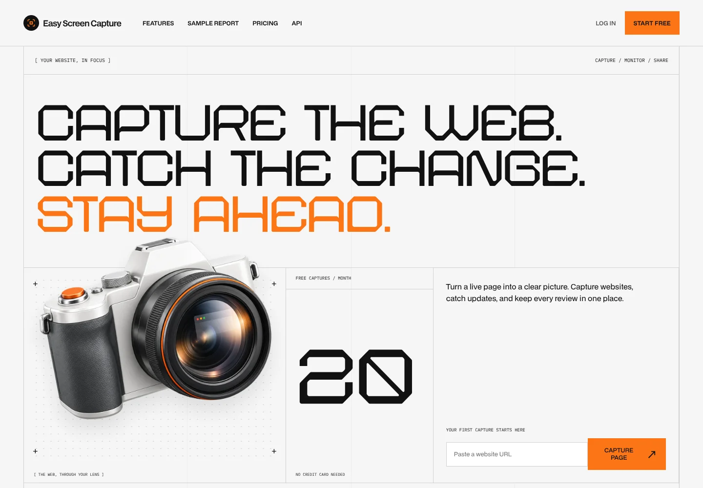
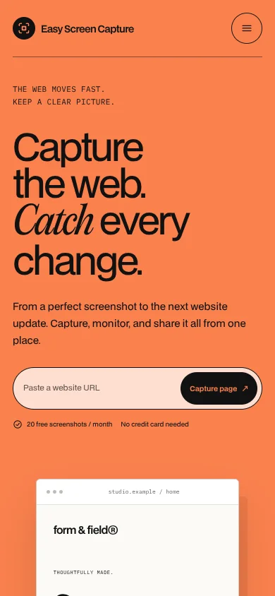
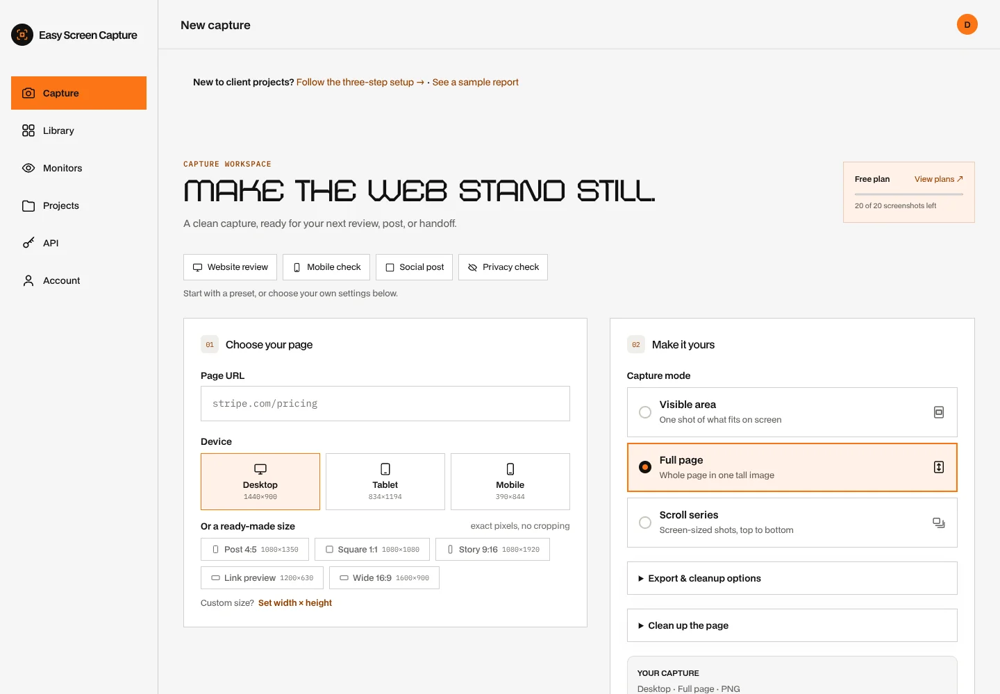
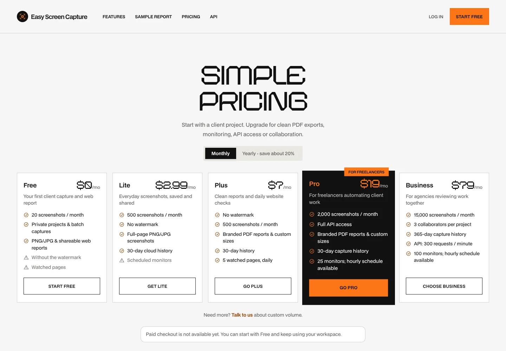

# Adon design review

## Demo selection

This branch applies **Adon / AI Agency / Light**, selected by the owner, from the supplied archive. It replaces the initial Startup Agency version on the same review branch. The design uses the demo’s Astro Nebula display font, BDO Grotesk body font, ruled light grid, square orange controls, tabbed features, horizontal showcase and original 3D shape assets.

## Coverage

- Rebuilt homepage: oversized three-line hero with a custom floating 3D camera, working URL handoff, product preview, keyboard-accessible feature tabs, horizontal showcase, capture modes, floating 3D monitoring section, plan-derived counters, API example, native FAQ and closing CTA.
- Shared AI Agency typography, palette, square buttons, inputs, header and grid footer across pricing, features, API docs, legal/support pages and reports.
- Grid-based login/signup layouts, preserving form IDs, submit handlers and redirect fields.
- Matching workspace rail, active navigation, capture panels, inputs, selected presets and usage cards. The responsive bottom navigation and existing app controls remain intact.
- GSAP title/card reveals, desktop parallax, counters, floating/pointer-responsive cubes, rolling button labels, hover transitions and scroll-progress/back-to-top control.

The agency client logos/testimonials/team portraits are replaced with product content rather than presented as customer endorsements. The product artwork is explicitly labelled as illustrative. Blocking preloaders, scroll interception and cursor replacement are not carried into a productivity app. Content remains readable if JavaScript or the animation assets fail. Reduced-motion preference and the explicit motion pause control stop optional motion.

## Changing the demo before merging

The theme is intentionally isolated:

| File                                 | Responsibility                                        |
| ------------------------------------ | ----------------------------------------------------- |
| `src/styles/adon.css`                | Shared tokens and public/app/control styling          |
| `src/styles/adon/ai-source.css`      | Attributed original AI Agency rules                   |
| `src/styles/adon/ai-landing.css`     | Product-specific demo adaptation and responsive rules |
| `src/styles/adon/ai-system.css`      | Shared AI Agency visual system                        |
| `src/styles/adon/previews.css`       | Product illustration styles                           |
| `src/scripts/adon-ai.ts`             | Accessible tabs, gallery and cube interactions        |
| `src/pages/index.astro`              | Demo composition and product content                  |
| `src/scripts/adon-motion.ts`         | Optional marketing motion                             |
| `src/components/AdonPreview.astro`   | Product illustrations                                 |
| `src/components/AdonAuthStory.astro` | Account-page editorial panel                          |
| `src/components/ConceptArt.astro`    | Capture-mode and capability illustrations             |
| `src/components/AiPage.astro`        | Public page shell: header, ruled grid and footer      |
| `src/components/AiPageHead.astro`    | Page hero: label rule, display title and lede row     |
| `src/components/AiDoc.astro`         | Long-form layout with a sticky section index          |
| `src/styles/adon/ai-pages.css`       | Page head, doc, prose and action primitives           |
| `src/styles/adon/ai-report.css`      | Before/after report layout (sample, links and app)    |
| `public/vendor/adon/`                | Selected fonts, original shapes and motion libraries  |

To try a different Adon demo, replace the landing composition/source stylesheet and adapt the shared tokens and motion hooks on this same branch. No database, billing, capture engine, monitor or API changes are needed. This is a single chosen demo, not a runtime demo switcher.

## Validation

- `npm run build`: passes, including existing commerce checks.
- `npm run check`: zero errors/warnings; existing deprecated clipboard API hint only.
- Production preview: desktop and mobile homepage, pricing, features, docs, support, terms, privacy, sample report, login and signup render successfully.
- Feature tab click/arrow/Home/End navigation, gallery controls, motion pause/reduced-motion behavior, mobile menu open/close/Escape, FAQ, URL normalization/signup handoff and monthly/yearly pricing controls checked.
- Isolated local D1: signup and Capture, Library, Monitors, Projects, API and Account pages checked; mobile capture preset and bottom navigation retained.
- Local screenshots inspected at 1440px and 390px. No horizontal overflow on the checked routes.

No remote data, Stripe purchases, live screenshot jobs or notifications were exercised. No migrations or new environment variables are needed for this redesign.

## Review screenshots

Desktop homepage:

Mobile homepage:

Capture workspace:

Pricing:

The camera is original AI-generated artwork, delivered as a transparent WebP. See [camera-hero.md](camera-hero.md) for the exact generation prompt and motion behavior.
